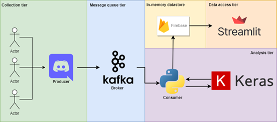

<!--
Hey, thanks for using the awesome-readme-template template.  
If you have any enhancements, then fork this project and create a pull request 
or just open an issue with the label "enhancement".

Don't forget to give this project a star for additional support ;)
Maybe you can mention me or this repo in the acknowledgements too
-->

<!--
This README is a slimmed down version of the original one.
Removed sections:
- Screenshots
- Running Test
- Deployment
- FAQ
- Acknowledgements
-->

<div align="center">

  
  <h1>Discord Realtime Analysis</h1>
  
  <p>
    A realtime discord chat analysis and vietnamese hatespeech detection using Keras and Firebase
  </p>

  
<!-- Badges -->
<p>
  <a href="">
    
  </a>
  <a href="https://github.com/Louis3797/awesome-readme-template/stargazers">
    
</p>
   
<h4>
    <a href="#demo-picture">Demo picture</a>
  <span> · </span>
    <a href="#run-locally">Run it yourself </a>
  <span> · </span>
    <a href="#contributer">About</a>
  </h4>
</div>

<br />

<!-- Table of Contents -->
# Table of Contents

- [About the Project](#about-the-project)
  * [Tech Stack](#tech-stack)
  * [Features](#features)
  * [Environment Variables](#environment-variables)
- [Getting Started](#getting-started)
  * [Prerequisites](#prerequisites)
  * [Installation](#installation)
  * [Run Locally](#run-locally)
- [Usage](#usage)
- [Demo](#roadmap)
- [Contact](#contact)
- [Acknowledgements](#acknowledgements)
  

<!-- About the Project -->
## About the Project

<div align="center"> 
  
</div>


<!-- TechStack -->
### Tech Stack


  <ul>
    <li><a href="https://www.typescriptlang.org/">Keras</a></li>
    <li><a href="https://nextjs.org/">MLFlow</a></li>
    <li><a href="https://reactjs.org/">Firebase</a></li>
    <li><a href="https://tailwindcss.com/">Discordpy</a></li>
  </ul>

<!-- Features -->
### Features

- Realtime analyze chat in discord channel with Deep Learning
- Store message and sentiment into Firebase realtime database
- Realtime report dashboard


<!-- Env Variables -->
### Environment Variables

To run this project, you will need to add the following environment variables to your .env file

`FIREBASE_KEY` : path to Firebase credential json
`FIREBASE_DB_URL`: url of Firebase realtime database
`TOKENIZER_PATH`: path to text tokenizer
`KERAS_MODEL_PATH`:  path to bilstm model
`DISCORD_TOKEN`: dev token of discord
`DISCORD_GUILD`: server id

<!-- Getting Started -->
## Getting Started

<!-- Prerequisites -->
### Prerequisites

This project uses miniconda as environment variable, you can use pipenv or something else.


<!-- Installation -->
### Installation

```bash
make install
```
<!-- Run Locally -->
### Run Locally

Clone the project

```bash
  git clone https://github.com/tsdocode/discord-realtime-analysis
```

Go to the project directory

```bash
  cd discord-realtime-analysis
```

Install dependencies

```bash
  make install
```

Start the server

```bash
  yarn run
```


<!-- Usage -->
## How to?

### Train Vietnamese detection using BiLSTM
#### Dataset
- [VIHSD](https://github.com/sonlam1102/vihsd)
- [VLSP-2019](https://www.aivivn.com/contests/8?fbclid=IwAR0AncPW2Hy6uH4jrNYS0-lpmmPqru2yslZVAjV6GOl8KqhrO9FM1CXAiNc)
#### Model
- BiLSTM

#### Training metrics


### Connect with discord 
- Install discord.py
```
pip install discord.py
```
- Create discord client
```py
TOKEN = os.getenv('DISCORD_TOKEN')
GUILD = os.getenv('DISCORD_GUILD')

client = discord.Client(intents=discord.Intents.all())
```
### Save data to firebase
Everytime get message from user
```py
    text_sentiment = sentiment(text)

    db.push({
        "user" : message.author.name,
        'channel': message.channel.name,
        "content": message.content,
        "sentiment":text_sentiment,
        "time": datetime.now().strftime("%Y-%m-%d %H:%M:%S")
    }, "/server/message_log")
```
### Load data to dashboard
```py
def get_data():
    db = load_db()
    messages = db.get("server/message_log")

    text = ""

    messages = [messages[i] for i in messages]
    text = " ".join([i["content"] for i in messages])
    messages = pd.DataFrame.from_records(messages)
    messages['time'] = pd.to_datetime(messages['time'])
    messages.set_index('time', inplace=True)
    

    channels = db.get("server/channels")
    members =  db.get("server/members")

    return members, channels, messages, text

```

<!-- Roadmap -->
## Demo picture

<!-- Contributing -->
## Contributer

<a href="https://github.com/tsdocode/discord-realtime-analysis/graphs/contributors">
  
</a>


<!-- Contact -->
## Contact

Thanh Sang - [@linkedin](https://www.linkedin.com/in/tsdocode/) - tsdocode@gmail.com


<!-- Acknowledgments -->
## References

Use this section to mention useful resources and libraries that you have used in your projects.

 - [Vietnamese hatespeech training script](https://github.com/huynhduchuydp36/VLSP2019-SHARED-Task-Hate-Speech-Detection-on-Social-Networks-Using-Bi-Lstm)
 - [Discord bot guide](https://realpython.com/how-to-make-a-discord-bot-python/)
 - [MLFlow getting started](https://www.mlflow.org/docs/latest/quickstart.html)
 - [Firebase](https://firebase.google.com/)
 - [Streamlit](https://streamlit.io/)
